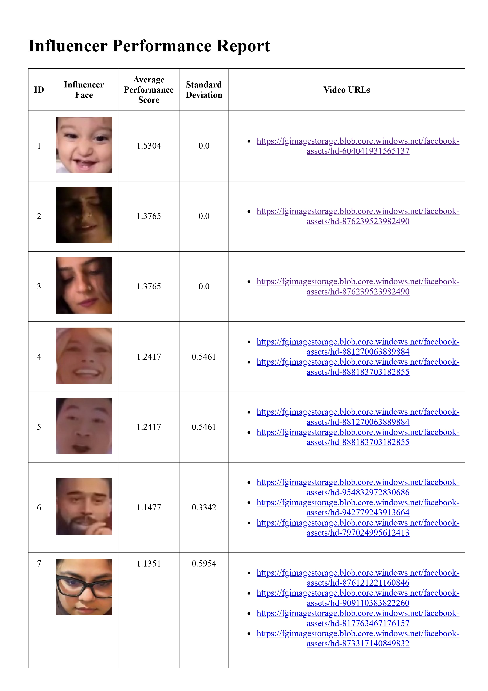

# The problem

We need to build a system that can:
1) Identify unique influencers appearing across these videos
2) Calculate the average performance for each influencer 
3) Help understand which influencers consistently drive better engagement

# Solution v0

1) We start by fetching the videos from the CSV file using `get_video_data.py` and store them in `data` folder.
  
2) We then run `face_detection.py` to perform face detection using OpenCV. The extracted faces are filtered by confidence score and dimensions and stored in `faces` folder.
  
3) Encodings for these images are generated using `encode_faces.py`. The command to generate encodings is `python encode_faces.py --dataset faces --encodings <encoding_file_name>.pickle --detection-method <hog/cnn>
`. The `hog` method is faster for CPU-only devices, while `cnn` is slower but more accurate.
  
4) Next, we run `face_clustering.py`, which loads this encodings file and uses DBSCAN to categorize the faces.
  
5) Since DBSCAN can create multiple clusters for a single individual, we perform agglomerative clustering on top of it to narrow down the list of unique faces.
  
6) For this, we generate all possible pairs from the clusters formed in DBSCAN, and select k=2 images from each cluster of the pair.
  
7) We then compare the similarity between these 4 image combinations - `(c1_img1, c2_img1)`, `(c1_img2, c2_img1)`, `(c1_img1, c2_img2)`, `(c1_img2, c2_img2)` and store the average of these values as the distance between the two clusters.
  
8) We then define a threshold value for the distance and start merging the cluster pairs in ascending order of distance. A threshold value of `0.37` was found to be appropriate.
  
9) Once this is done, we build an inverted index of faces using `report_generation.py`, which maps each influencer to the set of videos they appear in, to support further calculations.
  
10) For each influencer, we calculate the mean and standard deviation of their performance. (Note that influencers that appear only in a single video will have a standard deviation of 0)
  
11) Finally, the face of each influencer along with their corresponding performance is displayed as a HTML report.

# Challenges

1) Dealing with false positives while detecting faces
2) Some faces remain unclustered if their count is less than `min_samples` parameter for DBSCAN 
3) Clustering faces (DBSCAN created multiple clusters for the same person)
4) More sophisticated algorithms needed to improve clustering performance.

# Brownie points

1) Good face detection performance, segregates most real faces from photographic faces.
2) Double clustering (DBSCAN + Agglomerative)
3) Automatic HTML report generation that displays the influencer's face, performance and the video URLs they are seen in.
4) This method can scale to handle more videos with an increasing number of unique influencers across them.

# Results

To view the entire report, view `influencer_report.html` or `influencer_report.pdf` in this repo.
